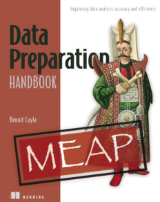

# Data preparation handbook (code and resources)

## Data sources per chapter
* **Chapter 1** Introduction to data preparation
* **Chapter 2** Unveiling the secrets of data
	* Titanic [Original dataset](https://www.kaggle.com/competitions/titanic)
*  **Chapter 3** Data quality challenges
	* Titanic [Original dataset](https://www.kaggle.com/competitions/titanic)
* **Chapter 4** Techniques for data transformation
	* Video games [Original dataset](https://www.kaggle.com/datasets/mohamedtarek01234/steam-games-reviews-and-rankings)
* **Chapter 5** Reveiling informations
	* Top restaurants in LA (2023) [Original dataset](https://www.kaggle.com/datasets/lorentzyeung/top-240-recommended-restaurants-in-la-2023)
	* BBC News [Original dataset](https://www.kaggle.com/datasets/gpreda/bbc-news)
	* Folder Images
	* Titanic [Original dataset](https://www.kaggle.com/competitions/titanic)
* **Chapter 6** Data preparation for machine learning and AI
	* Bike rental [Original dataset](https://www.kaggle.com/competitions/bike-sharing-demand/data)
* **Chapter 7** Data preparation for dashboards and reports
	* Superstore [Original dataset](https://www.kaggle.com/datasets/vivek468/superstore-dataset-final)
* **Chapter 8** Generative AI for data preparation
* **Chapter 9** Visual data preparation with Alteryx
* **Chapter 10** Data preparation at scale
* **Chapter 11** Trends and future challenges

*Note: Some datasets have been modified from their original versions.*
